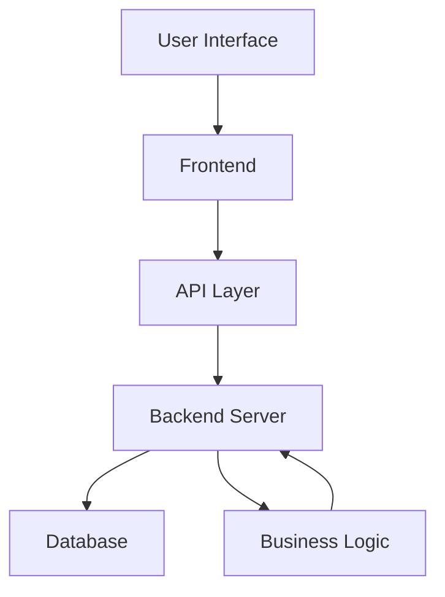
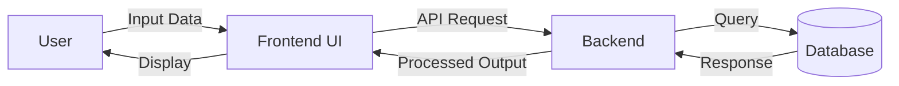
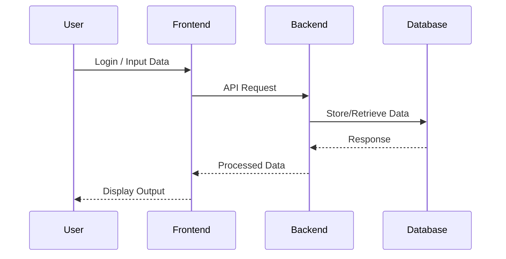
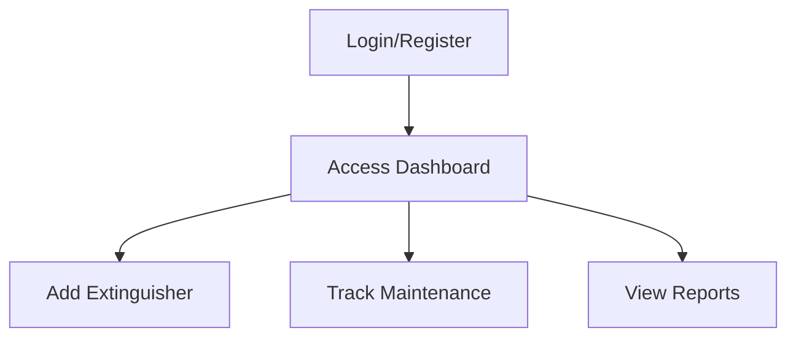

# FireSYS – Smart Fire Extinguisher Management System

---

## Overview

FireSYS is a centralized platform designed to digitally manage fire extinguishers across multiple locations. It ensures timely maintenance, improves visibility, and enhances safety compliance through an integrated system.

---

## Problem Statement

| Issue                        | Impact                      |
| ---------------------------- | --------------------------- |
| Manual record keeping        | High chances of human error |
| Missed maintenance schedules | Safety risks                |
| No centralized tracking      | Poor visibility             |
| Lack of alerts               | Delayed actions             |

---

## Solution

FireSYS provides a structured, automated system that:

* Tracks extinguisher lifecycle
* Manages maintenance schedules
* Provides real-time system visibility
* Reduces operational risk

---

## Key Features

| Module                  | Description                           |
| ----------------------- | ------------------------------------- |
| Authentication          | Secure login and user management      |
| Extinguisher Management | Add, update, delete extinguisher data |
| Maintenance Tracking    | Monitor servicing and inspections     |
| Dashboard               | Centralized system overview           |
| Database System         | Query-based data handling             |

---

## System Architecture



---

## Data Flow Diagram



---

## System Workflow



---

## Tech Stack

| Layer           | Technology            |
| --------------- | --------------------- |
| Frontend        | HTML, CSS, JavaScript |
| Backend         | Node.js / Python      |
| Database        | MySQL / SQLite        |
| Version Control | Git, GitHub           |

---

## Folder Structure

```plaintext
FireSYS/
│
├── backend/
│   ├── api/
│   ├── services/
│   ├── database/
│
├── frontend/
│   ├── components/
│   ├── pages/
│
├── README.md
├── requirements.txt / package.json
```

---

## Installation & Setup

### Clone Repository

```bash
git clone https://github.com/Parthavi2/FireSYS.git
cd FireSYS
```

### Backend Setup

```bash
cd backend
install dependencies
run server
```

### Frontend Setup

```bash
cd frontend
install dependencies
start application
```

---

## Usage Flow



---

## Performance & Benefits

| Metric                | Improvement |
| --------------------- | ----------- |
| Maintenance tracking  | Automated   |
| Data accuracy         | High        |
| Monitoring efficiency | Improved    |
| Safety compliance     | Enhanced    |

---

## Future Enhancements

* Real-time alert notifications
* Mobile application integration
* IoT-based extinguisher monitoring
* Predictive maintenance using AI

---

## Contribution

Fork the repository and submit pull requests for improvements.

---

## License

This project is developed for academic and hackathon purposes.
